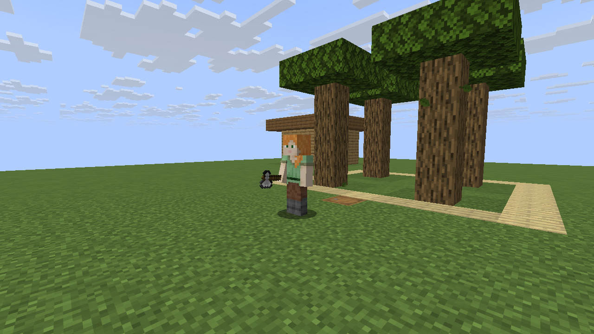

# NPCraft

[](https://github.com/CesarPetrescu/npcraft/actions/workflows/ci.yml)

**Controllable Minecraft Java companions that respect explicit work boundaries.**

NPCraft is an original, server-side datapack: player-shaped mannequin companions,
owner-checked controls, bounded navigation, and a resource-accounted timber job.
No client mod, resource pack, external service, or language model is required.
It is not a port of Gamemode One's Marketplace assets or code.

> **0.1.0-alpha.1 — experimental vertical slice, not production-ready.**
> Use a new test world or a backup. Bodies are deliberately invulnerable in this
> release. Movement is flat-ground, cardinal, grid-stepped navigation—not smooth
> player locomotion. “Timber job” means bounded oak/birch log harvesting, not a
> complete autonomous forestry/survival system.

## See it in Minecraft



The [graphical playtest and seven-screenshot gallery](docs/CLIENT_PLAYTEST.md)
records **27 passing client acceptance checks**, including actual native-menu
clicks, a complete 16-log harvest/deposit, exact axe wear, and two-client ownership
isolation. These are captures from the unmodified vanilla client in a disclosed
local test fixture, not generated illustrations. The alpha's gameplay limitations
below still apply.

## Compatibility

| Component | Target |
|---|---|
| Minecraft | **Java Edition 26.3**, vanilla server or singleplayer |
| Datapack format | **121.0**, exact target, no speculative compatibility range |
| Server Java | **25 or newer** |
| Development tools | Python **3.13**, standard library only |
| Client additions | None |

Older releases, Bedrock, Paper/Fabric behavior, Realms deployment, and future Java
versions are not claimed as tested. See [version sources](docs/SOURCES.md).

## What is implemented

| Area | This alpha |
|---|---|
| Management | Recruit, select nearest owned companion, follow, stay, home, stop, status, dismiss |
| UI | Native **G / Quick Actions** and pause-menu dialog; `/trigger` fallback |
| Authorization | Operator approval, owner ID **and player UUID** checks, command-distance checks |
| Navigation | Bounded breadth-first search, 128-node cap, six-block local radius, flat cardinal steps, rolling frontier steps for far goals |
| Work | An explicitly assigned **7 × 7 × 4** plot; oak and birch logs only; timed cutting and line-of-sight checks |
| Accounting | Give a real unenchanted iron axe; preserve its item data; wear it once per harvested log; carry up to 64 same-type logs |
| Output | Deposit into an assigned barrel's **empty** slot; stop without losing cargo when full/missing |
| Persistence | Marker-held records, scoreboard IDs/modes, fair persistent scheduler queue; reload-safe initialization |
| Distribution | Deterministic installable ZIP, SHA-256 checksum, CI artifacts and tag-triggered releases |

**Not implemented:** crafting/progression, mining ores, farming, replanting,
leaf clearing, normal combat/death, armor management, boats/mounts, stairs/jumps,
portal travel, arbitrary building, unrestricted inventory GUI, chat/LLM integration.
The complete [scope](docs/SCOPE.md) separates these from delivered code.

## Install

Download the **inner datapack ZIP** from a successful CI run's `npcraft-datapack`
artifact, or from a published GitHub release. The artifact download itself may be
an outer archive containing the installable ZIP and its checksum.

Put `npcraft-0.1.0-alpha.1-mc26.3.zip` in:

```text
<world>/datapacks/
```

Alternatively, copy this repository's **`datapack/` directory**, renamed to
`npcraft`, into that folder. The resulting path must be:

```text
<world>/datapacks/npcraft/pack.mcmeta
```

Do **not** install GitHub's source-code ZIP as the datapack. Run `/reload`, then
`/datapack list enabled`. Cheats/operator permission are needed for installation.

An operator must approve each user explicitly:

```mcfunction
/execute as <player> run function npcraft:admin/grant
```

Use the player's actual Minecraft name in place of `<player>`. Normal interaction
thereafter uses permission-zero trigger requests, not operator commands.

## First companion and first timber job

1. Stand on ordinary full-block ground in the **Overworld**. Press **G**, choose
   **Recruit companion**. The new companion is selected automatically.
2. Use **Follow me**, **Stay**, **Set home here**, and **Return home** on a flat
   test area. Use **Select nearest owned** when switching companions.
3. Stand at the center of a safe timber plot and choose **Set timber plot here**.
   This permits **every oak/birch log** at X/Z ±3 from your feet and Y +0 through
   +3. It does **not** distinguish a tree from a building. Keep all builds outside.
4. Place a barrel on/flush with the same walkable level, with a clear approach.
   Stand on top of it and choose **Set barrel beneath me**. Leave empty slots.
5. Hold a normal **unenchanted iron axe**, choose **Give held iron axe**, then
   **Start timber job**. The axe leaves your hand; it is not copied for free.
6. Put a few oak/birch logs inside the plot for the first test. Stay within
   **64 blocks** while the companion works. A full load, type change, broken axe,
   or one unsuccessful complete scan causes it to try depositing existing cargo.

Only one log type is carried at a time. Deposits require a completely empty barrel
slot; this release intentionally does **not** merge into existing stacks. A full
barrel or missing route preserves the held load. **Return cargo** and **Return axe**
drop the real items at the companion's feet; anyone nearby can pick them up.

### Controls and distances

Press G again after an action. Key bindings can be changed in Minecraft controls.
All dialog buttons have `/trigger npcraft set <number>` equivalents:

| Number | Action | Number | Action |
|---:|---|---:|---|
| 1 | Open panel | 2 | Recruit |
| 3 | Select nearest owned | 4 | Follow |
| 5 | Stay | 6 | Set home at player |
| 7 | Return home | 8 | Set timber plot |
| 9 | Assign barrel beneath player | 10 | Start timber job |
| 11 | Stop job | 12 | Open dismissal confirmation |
| 13 | Status | 14 | Give held iron axe |
| 15 | Return axe as item drop | 16 | Return cargo as item drop |
| 99 | Confirm dismissal | | |

Selection range: **8 blocks**. Orders: **16 blocks**. Work/follow requires an
approved owner within **64 blocks**, in the same supported dimension. Maximum
allocations: **4 per owner / 16 globally**, including unloaded companions. These
are safety caps, **not a claim of benchmarked 16-companion performance**.

## Server administration

```mcfunction
/function npcraft:admin/pause
/function npcraft:admin/resume
/execute as <player> run function npcraft:admin/revoke
```

Pause/revoke preserves records and items. No chunks are force-loaded, no gamerules
are modified, and no global player teams are replaced. A companion in an unloaded
chunk simply does not run. Reconnect/reload does not reset ownership or counts.

A vanilla datapack cannot integrate arbitrary claim/protection plugins by magic:
**operator-approved users are trusted to designate only permitted land.** Test
on vanilla first. Do not use blanket `/kill` commands on NPCraft entities: the
marker owns the items, while the mannequin's axe is only a display copy.

Before uninstalling, dismiss companions while their chunks are loaded and collect
the drops. Merely deleting the ZIP leaves entities and saved state in the world;
see [operations and limitations](docs/OPERATIONS.md).

## Develop and test

```sh
python tools/validate.py
python -m unittest discover -s tests -v
python tools/build.py
```

The last command writes the installable ZIP and SHA-256 file into `dist/`.
Dependencies: Python standard library only—no `pip install` step.

To test actual Minecraft commands and behavior, install Java 25+, review the
[Minecraft EULA](https://aka.ms/MinecraftEULA), and explicitly accept it for the
isolated test server:

```sh
python tools/server_test.py --accept-eula
```

This downloads **the exact pinned vanilla version**, verifies Mojang's server
size/SHA-1, binds an offline test server to **127.0.0.1**, creates a disposable
world, and exports logs plus JUnit to `reports/`. It never opens your real world.

CI runs structural/mutation/build tests on Linux and Windows, then vanilla
integration on Linux, including server restart. The **Required** job fails on
failed, skipped, or cancelled prerequisites. Configure that check in GitHub branch
protection; adding a workflow does not itself prevent an administrator merging.

See [testing](docs/TESTING.md), [architecture](docs/ARCHITECTURE.md),
[roadmap](docs/ROADMAP.md), and [contribution guide](CONTRIBUTING.md).

## License and attribution

Original NPCraft code is MIT licensed. No Marketplace assets, paid add-on code,
third-party pathfinding implementation, Minecraft server binary, or texture is
redistributed. Not an official Minecraft product; not approved by or associated
with Mojang or Microsoft.
