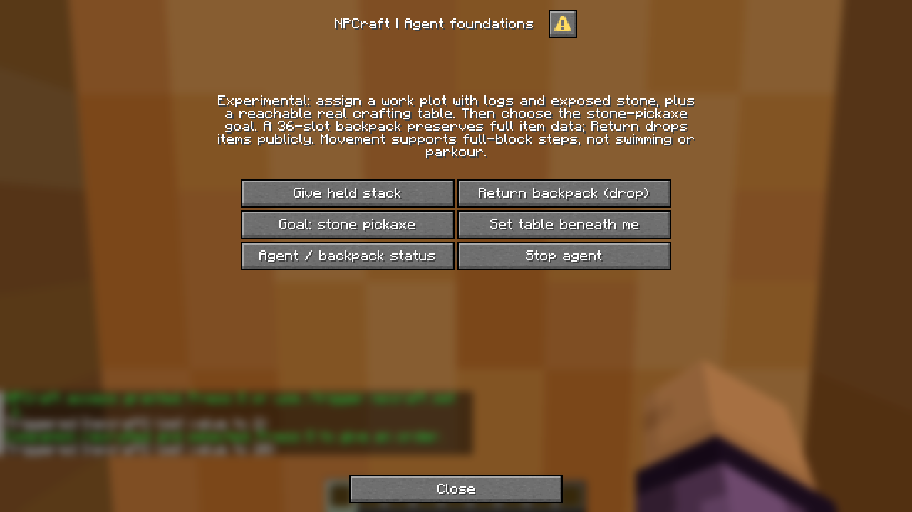
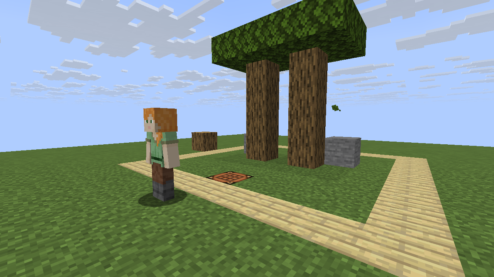
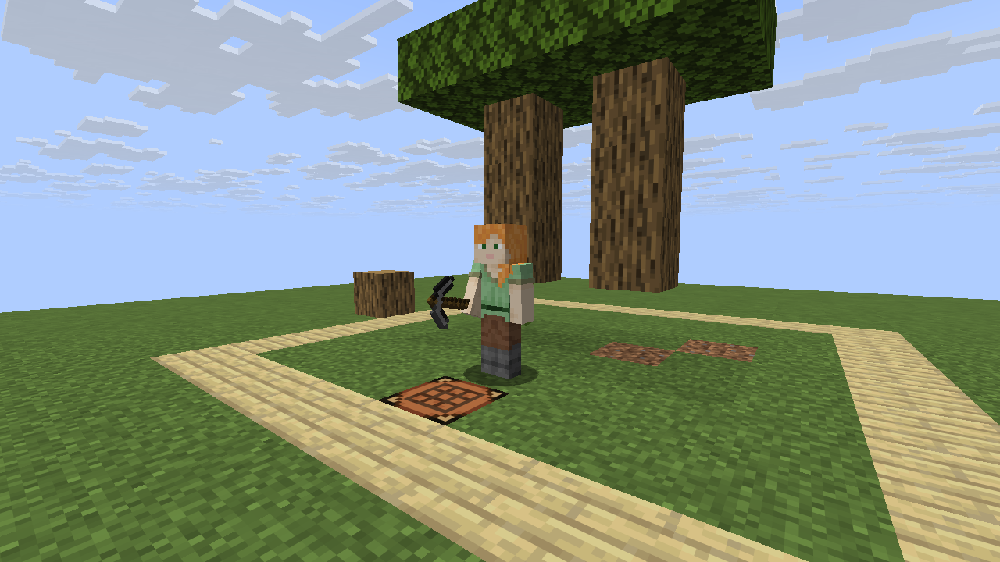
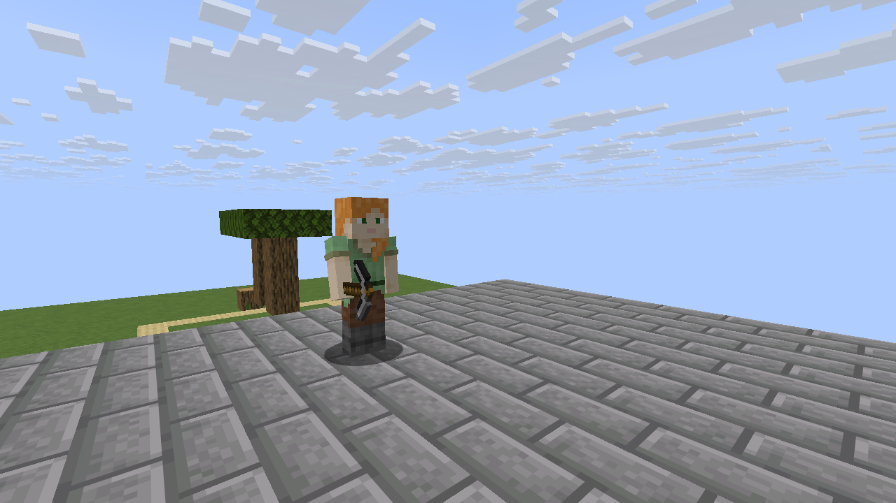

# Agent progression playtest — 0.2.0-alpha.1

This report covers the bounded autonomous crafting goal and inventory/vertical
movement additions. It does **not** claim full survival, PvP or arbitrary exploration.

## Executed checks

The final gameplay source is `f1d7b0ca010b4987481cb92d33f7be183acbd97f`.
The exact PR-merge SHA and run ID used for the screenshot session are recorded in
[`agent-screenshots/agent-results.json`](agent-screenshots/agent-results.json).

- Offline validation/build/contract tests: 40 passed on Linux and Windows.
- Actual vanilla Java 26.3 server suite: 44 passed, including restart persistence.
- Existing two-client graphical regression scenario: 27 passed.
- New real-client agent scenario: 21 passed.

[Vanilla/quality CI](https://github.com/CesarPetrescu/npcraft/actions/runs/35103672296)
· [Graphical session](https://github.com/CesarPetrescu/npcraft/actions/runs/35103672464)

The directly installable ZIP has SHA-256
`c23b935b603e2a096f3538e94a704dd169473f2600774bf0b1fc9b006f04baf8`.
The downloaded CI artifact and local deterministic build are byte-identical.
Subsequent evidence/documentation publication does not change datapack resources.

## What the client did

An unmodified client recruited the NPC as a non-operator. Actual mouse clicks in
the new native dialog transferred a named stack and started the stone-pickaxe goal.
The exact full item record was compared before/after transfer; item return preserved
count and cleared the backpack source. Assignment/cancel/follow requests were typed
through the game client, not impersonated by server commands.

The progression test then started with an empty backpack and no mining tool. It had
an explicitly assigned plot containing logs and exposed stone, and an existing
reachable crafting table. No commands supplied ingredients or per-block actions
after the goal started. The controller chose and executed the prerequisites:

```text
gather logs -> make planks/sticks -> wooden pick -> mine stone -> stone pick
```

The final balance was verified from the server: two logs and three stone blocks
harvested; one stone pick; one wooden pick with damage 3; three planks left; zero
unconsumed cobblestone. A log outside the plot stayed intact. The completed agent
stopped gathering and displayed the stronger stone pick rather than the last slot.

Following then reached the top of three full-block steps, verified at Y=67, without
modifying the checked route blocks. Cancellation and reload preserved the expected
state/items. This is bounded full-block traversal, not smooth jumping or support
for Minecraft's slab/stair-shaped blocks.

## Genuine captures

### Native agent controls


### Empty-handed start and disclosed work fixture


### Crafted stone pickaxe


### Full-block vertical follow


## Bugs caught and fixed

The runtime fixture originally exceeded the RCON request buffer when setting all
36 inventory slots at once; it now uses bounded per-slot writes. This was a test
transport failure, not evidence that the Minecraft server crashed. A name check
also assumed one text-component representation; the real client normalized it, so
the assertion now compares actual complete item records instead.

Review identified that read-only panels/status calls reset pending work. They now
leave target/timer/mode unchanged, and unknown actions return without mutation.
Backpack return explicitly stops the agent before dropping items.

Inspection of the first completed-goal screenshot revealed a production bug: tool
selection preferred the last valid slot, showing wood despite having crafted stone.
Selection now prefers the stronger supported usable tier. Regression tests cover
slot order, legacy cosmetic equipment, and stored unsupported picks that must not
incorrectly satisfy a mining prerequisite. The elevated screenshot camera was also
moved onto actual supported ground; no captured image was retouched.

## Method and limits

This was automated GUI playtesting on a GitHub Linux runner using Java 25, Xvfb/Mesa
and the official unmodified Minecraft client. Synthetic identities connect only to
an isolated loopback server; no Microsoft credentials or public-server login are
used. RCON creates the disclosed creative fixture, approves NPCraft access, frames
the camera and independently asserts results. The player remains a non-operator.

PNGs are direct framebuffer captures, with HUD hiding for world views. There is no
AI-generated image, compositing, item-count insertion or texture replacement. The
fixture's trees have persistent leaves, and only the logs required for the goal are
harvested. This is not a natural forestry/regrowth or cave-exploration test.

The scenario cannot certify unrestricted survival/PvP, human movement quality,
large-scale performance, audio/accessibility or every item component. Bodies remain
invulnerable; owners, bounded work plots and an assigned workbench are still required.
Both the implementation boundary and deferred features remain in
[AGENT_FOUNDATIONS.md](AGENT_FOUNDATIONS.md) and [SCOPE.md](SCOPE.md).
