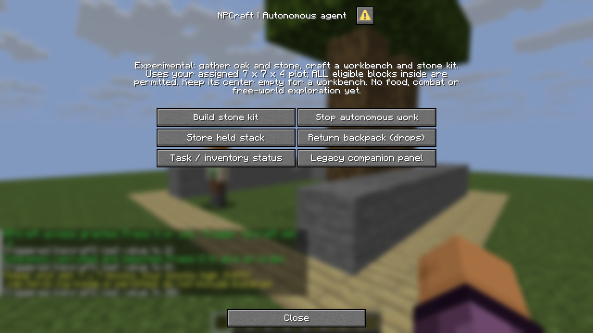
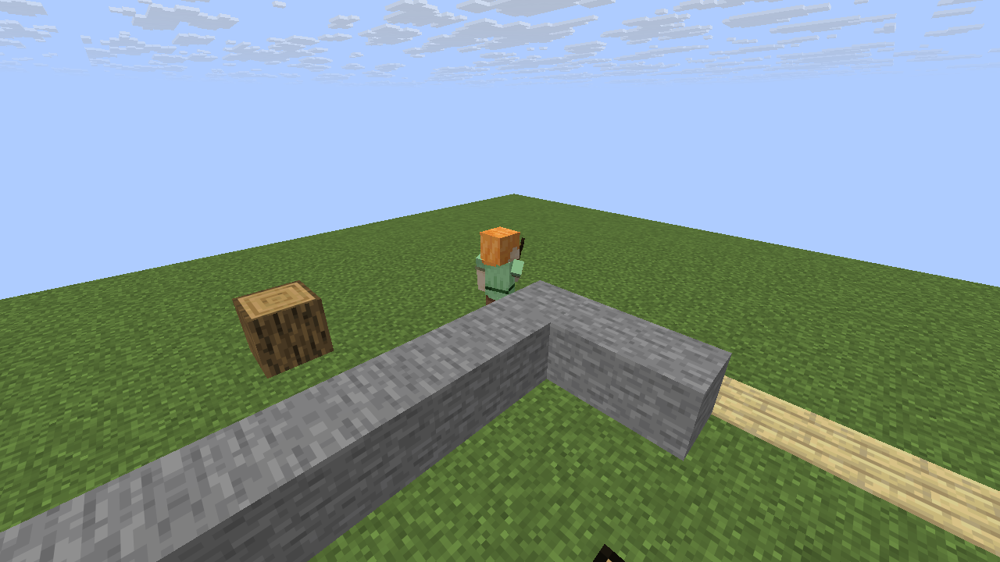
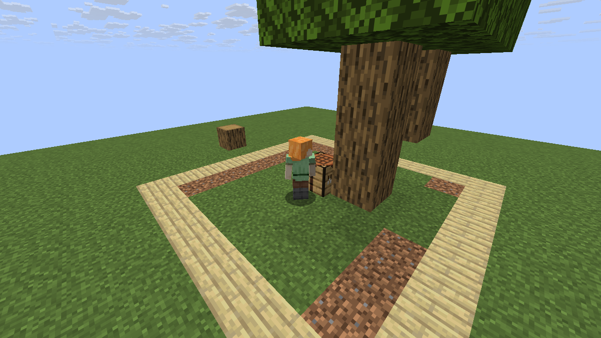
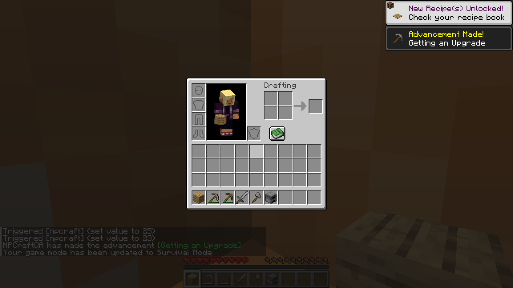
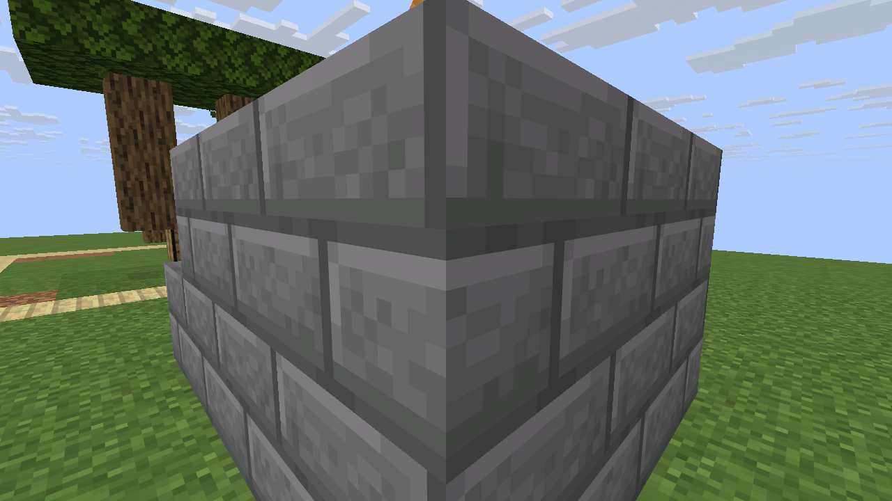

# Autonomous agent milestone — 0.2.0-alpha.1

## What changed

An approved companion can now receive **one stone-kit goal**, start with an empty
36-slot backpack, and choose gathering/crafting prerequisites itself. It can retain
multiple component-bearing item stacks, place a real workbench, make a wooden pick,
then produce a stone pickaxe, sword, axe and furnace. Loss of a supported kit item
causes re-evaluation and replacement, provided permitted resources remain available.

The shared navigator now handles conservative one-full-block ascent and descent,
including repeated steps. This is **bounded task autonomy**, not full survival or
an opponent. The owner must remain nearby; the agent is invulnerable, has no combat
or hunger, and searches only its explicitly assigned 7×7×4 work plot.

## Executed progression

The machine-readable [capture report](agent-screenshots/agent-results.json) records
its exact source commit, GitHub run ID and **25 individual graphical assertions**.
Screenshots below are committed evidence from that run, not static promotional art.

| Observation | Checked outcome |
|---|---|
| Initial state | No gifted tool; new backpack empty; actual non-operator client connects and recruits |
| Goal instruction | Actual native **Build stone kit** button starts mode 4; no internal planner/action command drives progress |
| Early progression | Workbench crafted/placed and wooden pickaxe obtained from world resources |
| Final equipment | One stone pickaxe, stone sword, stone axe and furnace item in the authoritative backpack |
| Resource accounting | **Three oak logs + sixteen stone blocks = nineteen successful removals**, with real ingredient consumption |
| Tool wear | Captured completed backpack contains wooden pick damage 3 and stone pick damage 13, totaling sixteen stone harvests |
| Leftovers | One oak plank and one stick remain before the deliberate lost-sword test |
| Boundaries | Deliberately eligible oak log outside the work plot remains unchanged |
| Proactivity | Test removes the sword and provides two more permitted stone blocks; replacement occurs without another goal command, mined count becomes 21 |
| Item return | Stop, return bag, collect physical drops; the four produced items appear in the actual player's inventory and bag becomes empty |
| Generic backpack transfer | A separately supplied named iron axe with damage 11 leaves the player's hand and retains its damage in the bag |
| Vertical movement | Real scheduled Follow reaches Y=66 over two one-block steps, then descends to Y=64 |
| Reload | The stored backpack item remains present after reload |

The fixture has extra logs, but no extra stone before the kit is complete. The
additional two stone blocks are explicitly part of the recovery test, not hidden
progression assistance. The named iron axe is supplied **after** the kit and return
checks solely to test generic item transfer; it is not a starter tool.

## Real Minecraft captures

### Goal control panel



### Autonomous stone gathering after making the first pickaxe



### Kit completed beside its own placed workbench



### Produced items returned into the actual player's inventory



### Following onto a raised terrace



## Capture method and limitations

An official unmodified Minecraft Java 26.3 client runs on a Linux GitHub runner
under Java25, Xvfb and Mesa software rendering. Client binaries, libraries and assets
are downloaded from official metadata and checked against their supplied hashes.
A disposable vanilla server binds to 127.0.0.1. The synthetic local identity is
NPCraftQA; no Microsoft account credentials or public-server authentication are used.

Keyboard/mouse input originates the actual client requests. RCON creates the
creative-mode resource/terrace fixture, approves the player for NPCraft (not operator
permissions), positions the camera and independently checks world/inventory state.
Only the headless suite calls internal action/planner functions to isolate units;
the graphical progression runs through the normal scheduler after the client order.

The camera briefly switches to spectator mode during a tick freeze to hold the
view above terrain; creative mode and ticks resume afterwards. F1 hides the HUD for
world views. Those camera changes do not create equipment or drive agent decisions.
The inventory screenshot uses the real survival inventory after pickup. PNGs are
direct framebuffer captures, without image generation, enhancement, compositing or
inserted item counts. Test leaves are persistent; remaining/floating logs and leaves
are expected because the goal gathers only its required resources, not whole trees.

These are **automated graphical tests**, not a human free-form survival session or
a performance benchmark. Rendering/profile/Realms/narrator environment warnings may
occur; invalid command resources, macro errors and serialization errors are failures.

## Test and implementation boundaries

The new server suite includes 35 scenarios for inventories, rollback, recipes,
station requirements, mining permissions, breakage, step safety, recovery, memory
and persistence. The existing 22 vanilla scenarios and the existing two-client
worker/ownership graphical suite remain part of CI. The final committed revision's
CI is the authority on the full pass/fail result; the captured JSON identifies the
revision shown here, and counts are not coverage percentages.

The recipe graph has eight supported recipes and fixed goal priority, not arbitrary
Minecraft knowledge or a dynamically scored utility/GOAP planner. Backpack transfer
preserves arbitrary native item components, but mining deliberately uses only
standard breakable unenchanted wooden/stone picks. Legacy timber tools/cargo remain
separate; backpack GUI, armor/offhand and barrel integration are future work.

The world interaction layer is whitelisted and synchronous. It validates bounds,
reach, line of sight, occupancy/support, tool and capacity, and stages item changes
before world mutation. This is not crash-proof storage across partial world saves.
The current search/movement budget has not been production-load benchmarked.

## Reproduce

For the player walkthrough, follow README.md: approve/recruit, assign plot, keep
its center empty, provide permitted oak and stone, then open trigger 20 and start.
The minimum three logs/sixteen stone assumes the supported normal kit and no losses.

On a disposable Linux test runner with Java25, Xvfb, Mesa, xdotool and ImageMagick:

```sh
python tools/generate_agent.py --check
python tools/validate.py
python -m unittest discover -s tests -v
python tools/server_test.py --accept-eula --reports reports/legacy
python tools/agent_test.py --accept-eula --reports reports/agent
LIBGL_ALWAYS_SOFTWARE=1 GALLIUM_DRIVER=llvmpipe ALSOFT_DRIVERS=null \
  xvfb-run -a -s '-screen 0 1280x720x24 -ac +extension GLX +render -noreset' \
  python tools/agent_playtest.py --accept-eula
```

Review the Minecraft EULA before accepting it. Tests never open existing user saves.
The maintained CI is read-only and uploads diagnostics even on failure; it never
commits generated images back into PRs. Screenshots here were separately reviewed
and committed during development, not silently regenerated on every build.
