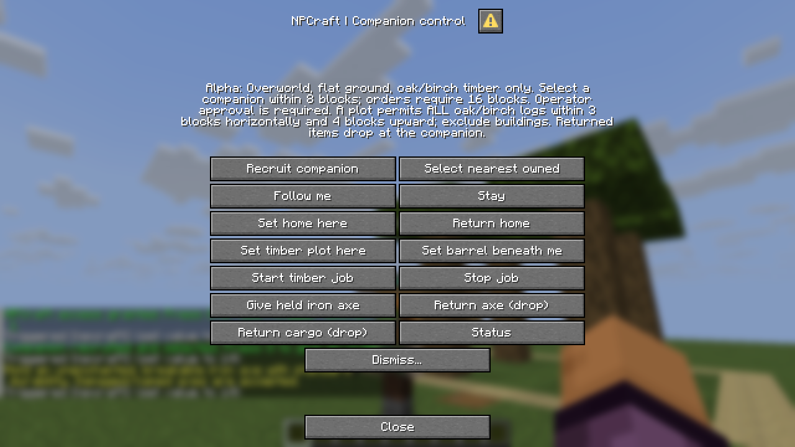
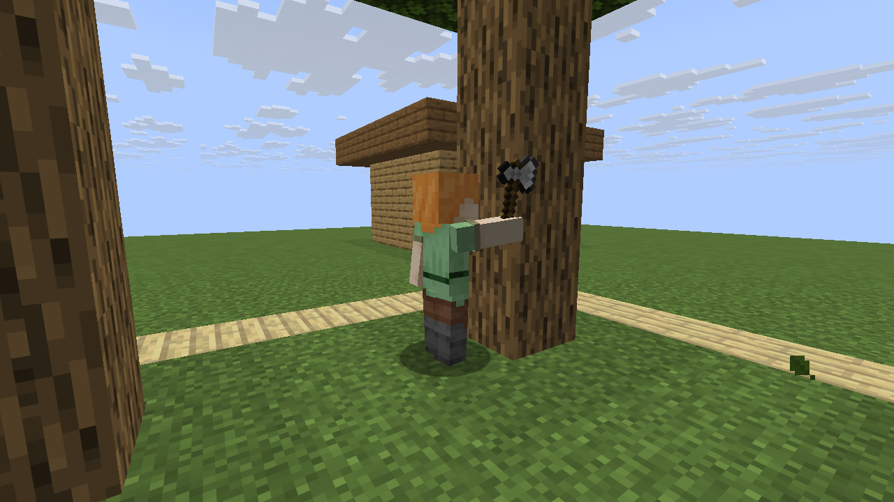
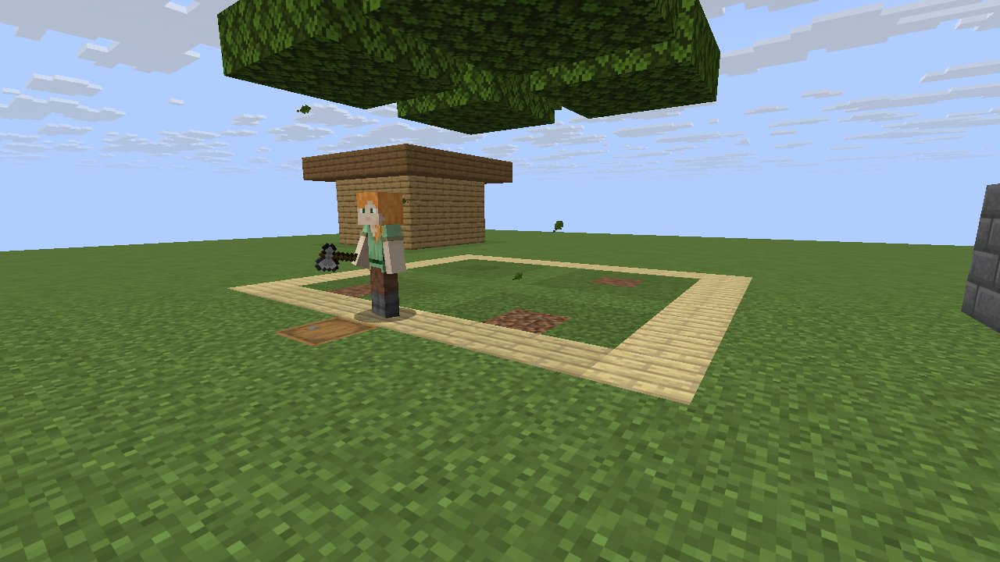
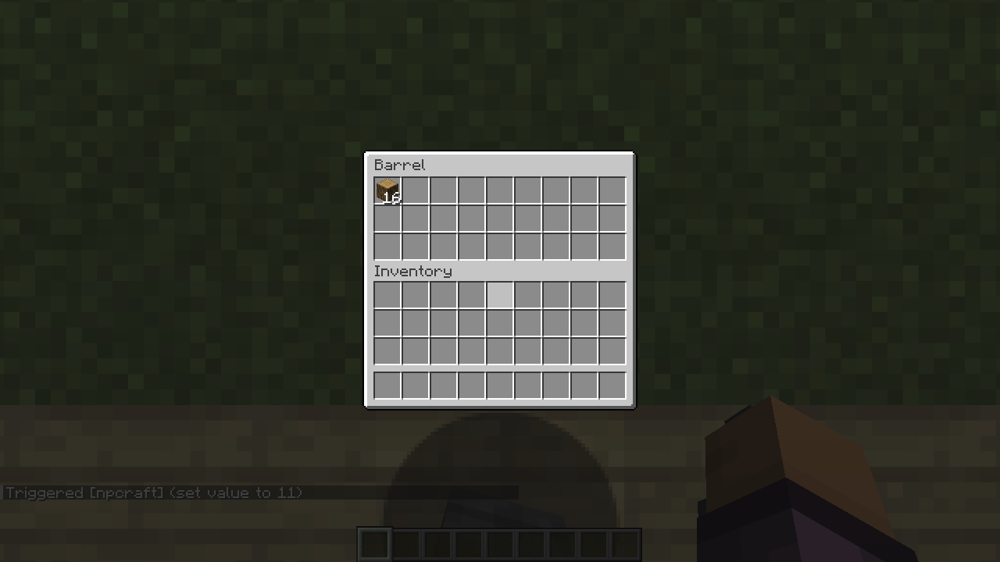
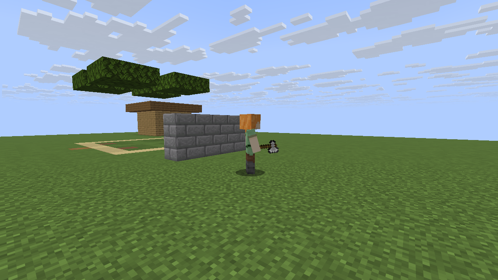
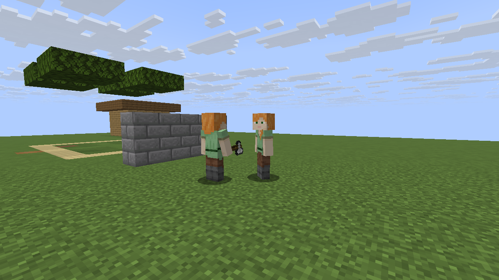

# Graphical Minecraft playtest

**Result: 27/27 graphical acceptance checks passed, with two unmodified Minecraft
Java 26.3 clients connected simultaneously.** The captured source commit, workflow
run and individual assertions are recorded in
[`screenshots/visual-results.json`](screenshots/visual-results.json).

This is an automated GUI playtest with screenshots inspected after capture, not a
claim that a human manually played a full survival session. The datapack itself
was not modified to pass this playtest; the alpha's gameplay scope is unchanged.

## What was exercised

| Scenario | Observed result |
|---|---|
| Native management menu | Actual mouse clicks recruited a companion, transferred an axe, and issued Follow and Stay from a non-operator client. |
| Unsupported equipment | An enchanted axe was refused and remained in the player's hand. |
| Existing tool state | An unenchanted named axe with damage 7 transferred out of the player's hand; the companion retained damage 7. |
| Autonomous timber loop | Four four-block trunks supplied exactly 16 oak logs. The companion found, reached, cut and deposited them without per-log test commands. |
| Resource accounting | The initially empty barrel contained exactly 16 logs; companion cargo was empty; axe damage was exactly 23 (7 + 16 cuts). |
| Work boundary | A deliberately eligible oak-log building corner outside the plot remained unchanged. |
| Navigation | Following reached the far side of a two-block-high stone-brick wall without breaking the checked wall block; Stay stopped the mode. |
| Two owners | Both graphical clients were present together. The second player could not select, command or dismiss the first owner's companion. |
| Corrupted selection defense | Even a test-only operator-written selection pointing at the other owner's ID did not authorize that client's Follow or Dismiss request. |
| Independent companion | The second player recruited a different companion with a different owner ID; the first owner's record remained assigned to that owner. |
| Reload | A controller remained present after `/reload` with the clients connected. Full process-restart persistence is tested separately by the vanilla server suite. |

The machine-readable report has 27 individual assertions. These are not 27 entire
manual playthroughs or a percentage of all possible gameplay coverage.

## Genuine in-game screenshots

### Companion with the transferred axe


### Native management interface



### Timber work and the completed plot





### Output checked in the real barrel interface



### Wall detour and separate owners





## Test environment and capture method

The workflow downloads the exact official client, libraries and assets, checking
Mojang's provided hashes, then starts an isolated vanilla server bound to
`127.0.0.1`. The two synthetic test identities are `NPCraftQA` and `NPCraftOther`.
No Microsoft credentials are read or stored, and these are not authenticated
sessions for joining public servers. The existing alpha ZIP is installed normally.

Java 25, Xvfb and Mesa provide the graphical environment on a Linux GitHub runner.
The inspected client logs show Minecraft's Vulkan backend using llvmpipe after
OpenGL could not obtain a matching GLX visual. That is software execution of the
actual Minecraft client, not a replacement renderer or a recreated Minecraft image.
The capture is 1280 x 720 with GUI scale 2. This setup is not a GPU/MSPT benchmark.

`xdotool` sends real keyboard and mouse input. Player `/trigger` requests originate
in the client; RCON does not impersonate those requests. RCON constructs the test
scene, grants NPCraft approval (not operator status), moves the player/camera, and
independently inspects world/entity state. The scene is a disclosed creative-mode
fixture, not a naturally generated survival world. Its output barrel starts empty.

PNGs are direct X framebuffer captures. F1 hides the HUD for some world views.
The server is briefly frozen while framing the cutting-state screenshot, then
unfrozen for the actual harvesting/deposit test. No AI-generated image, compositing,
texture replacement, inserted item count, or post-capture visual enhancement is used.
The test trees have deliberately persistent leaves; the floating canopy after the
trunks are harvested is expected fixture behavior, not a natural-leaf-decay test.

Anonymous profile/Realms requests can log authentication errors, and the runner
may log missing narrator-library and graphics-backend fallback messages. These
remain visible in the artifacts; a successful playtest does not mean every client
log message was error-free. Datapack resource/macro failures remain fatal checks.

## Reproduce on Linux

Install Java 25 and Python 3.13, then the graphical dependencies:

```sh
sudo apt-get install xvfb xdotool imagemagick libgl1-mesa-dri mesa-utils mesa-vulkan-drivers libglfw3 libopenal1
LIBGL_ALWAYS_SOFTWARE=1 GALLIUM_DRIVER=llvmpipe ALSOFT_DRIVERS=null \
  xvfb-run -a -s '-screen 0 1280x720x24 -ac +extension GLX +render -noreset' \
  python tools/client_playtest.py --accept-eula
```

Review the Minecraft EULA before accepting it. Nothing launches against an existing
save. Runtime binaries/assets remain under `.cache/`; disposable worlds are removed.
No game binary, test world, server properties or account credential is committed.

The **Graphical client playtest** workflow runs for pull-request changes
and can be invoked manually. Its maintained jobs have read-only repository
permissions and upload evidence as the `minecraft-client-playtest` artifact; they
do not automatically rewrite documentation or push screenshots to a branch.
The seven reviewed images in this document are a committed evidence snapshot.

Artifacts live under `reports/visual/`: raw PNGs, client/server logs, and
`visual-results.json` containing source commit, run ID and assertions. Failure
captures and diagnostic state are retained. Default artifact retention is 14 days;
the checked-in screenshot snapshot does not depend on the artifact remaining live.

## What this does not establish

The capture shows the alpha's current simple mannequin presentation, not natural
human-like movement. Navigation remains flat, cardinal and grid-stepped. This run
does not validate arbitrary terrain, combat/death, stairs, portals, natural forest
regrowth, controller recovery after a crash, every UI button, twenty companions,
or production-server performance. Public-server authentication and claim plugins
are not tested by synthetic localhost identities. Audio and narrator accessibility
also remain untested.

Prioritize movement/animation quality and broader inventory/recovery tests next;
do not relabel the existing timber slice as a complete survival-player replacement.
